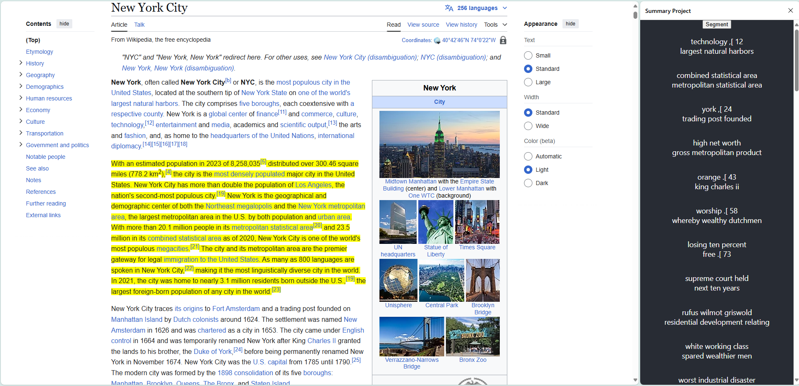

# Segmenter

This chrome/browser extension attempts to use sentence embeddings to (intuitively) break web pages into multiple passages.

Part of an exploration of mine into tools for parsing data.

## What it does

Currently it works as follows:

1. The chrome extension (via user prompt) queries for paragraph elements in the current document and splits into sentences (splitting on the `.` character). The extension sends this as a list of strings to the backend.
1. The backend produces an embedding for each sentence.
1. `PCA` is used to decrease the dimensionality of the embeddings.
1. `Pelt` from the `ruptures` library is used for [changepoint detection](https://en.wikipedia.org/wiki/Change_detection) to determine where the document changes topics.
1. `Rake` is used to produce two keyphrases from each document segment.
1. The segment boundaries and keyphrases are returned to the chrome extension.
1. The chrome extension displays the keyphrases, and highlights the segment (as determined by ruptures) of the document that the keyphrases correpsond to.

## Known issues / Future work

1. The keywords functionality isn't great. Maybe it should be removed in favor of some UI showing the progression of segments. Perhaps we can even show how (dis)similar segments are to each other.
1. The highlighting functionality sometimes fails completely (and leaves the previous hightlighting state in place), and sometimes fails to highlight to the end of the segment.
1. Currently using `PCA` for decomposition. Other techniques may be better. (see [NMF](https://scikit-learn.org/stable/modules/decomposition.html#non-negative-matrix-factorization-nmf-or-nnmf), however this requires embeddings to be non-negative).
1. Could we put the model and changepoint detection in the browser (via WASM)? Should we?
